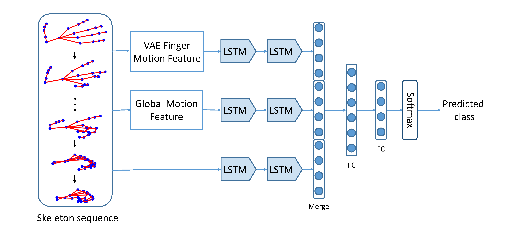

## MFA-Net: Motion Feature Augmented Network for Dynamic Hand Gesture Recognition from Skeletal Data

Xinghao Chen<sup>1</sup>, Guijin Wang<sup>1</sup>, Hengkai Guo<sup>2</sup>, Cairong Zhang<sup>1</sup>, Hang Wang<sup>3</sup>, Li Zhang<sup>1</sup>

<sup>1</sup>Department of Electronic Engineering, Tsinghua University&nbsp;&nbsp;&nbsp;&nbsp; <sup>2</sup>AI Lab, Bytedance Inc&nbsp;&nbsp;&nbsp;&nbsp; <sup>3</sup>Beijing Huajie IMI Technology Co., Ltd

[\[PDF @ ICIP'17\]](https://arxiv.org/abs/1708.03278)&nbsp;&nbsp;&nbsp;&nbsp;[\[PDF @ Sensors'19\]](https://www.mdpi.com/1424-8220/19/2/239)

### Introduction
This repository contains the demo code for [MFA-Net](https://arxiv.org/abs/1708.03416), an accurate method for skeleton-based dynamic hand gesture recognition.


<div align=center>
Figure 1: Framework of MFA-Net.
</div>

### Citation
If you find our work useful in your research, please consider citing:

    @article{chen2019mfanet,
      title={MFA-Net: Motion Feature Augmented Network for Dynamic Hand Gesture Recognition from Skeletal Data},
      author={Chen, Xinghao and Wang, Guijin and Guo, Hengkai and Zhang, Cairong and Wang, Hang and Zhang, Li},
      journal={Sensors},
      year={2019},
      volume = {19},
      number = {2},
      ARTICLE-NUMBER = {239},
      doi = {10.3390/s19020239}
    }

    @inproceedings{chen2017motion,
      title={Motion feature augmented recurrent neural network for skeleton-based dynamic hand gesture recognition},
      author={Chen, Xinghao and Guo, Hengkai and Wang, Guijin and Zhang, Li},
      booktitle={Image Processing (ICIP), 2017 IEEE International Conference on},
      pages={2881--2885},
      year={2017},
      organization={IEEE}
    }


## Dependencies
- [keras 2.0.6](https://keras.io)
- theano 0.9.0 or tensorflow 1.2.0
- [seaborn](https://seaborn.pydata.org/) (For drawing confusion matrix)

## Datasets
- [DHG-14/28 Dataset](http://www-rech.telecom-lille.fr/DHGdataset/) [1]
- [SHREC17 Dataset](http://www-rech.telecom-lille.fr/shrec2017-hand/) [2]

## Training

```bash
bash sh/train_MFA_Net_shrec17_vae_14.sh  # For DHG-14/28 dataset (14 gestures)
bash sh/train_MFA_Net_shrec17_vae_14.sh  # For DHG-14/28 dataset (28 gestures)
bash sh/train_MFA_Net_shrec17_vae_14.sh  # For SHREC17 dataset (14 gestures)
bash sh/train_MFA_Net_shrec17_vae_14.sh  # For SHREC17 dataset (28 gestures)
```

## Testing:
```bash
bash sh/test_MFA_Net_shrec17_vae_14.sh  # For DHG-14/28 dataset (14 gestures)
bash sh/test_MFA_Net_shrec17_vae_14.sh  # For DHG-14/28 dataset (28 gestures)
bash sh/test_MFA_Net_shrec17_vae_14.sh  # For SHREC17 dataset (14 gestures)
bash sh/test_MFA_Net_shrec17_vae_14.sh  # For SHREC17 dataset (28 gestures)
```

Use the following command to draw confusion matrix for the predicted results:
```bash
python src/cnf_DHG.py  # For DHG-14/28 dataset
python src/cnf_SHREC.py  # For SHREC17 dataset
```

## Reference
- [1] [Skeleton-based Dynamic hand gesture recognition](http://www.cv-foundation.org/openaccess/content_cvpr_2016_workshops/w21/papers/De_Smedt_Skeleton-Based_Dynamic_Hand_CVPR_2016_paper.pdf), Quentin De Smedt, Hazem Wannous and Jean-Philippe Vandeborre, 2016 IEEE Conference on Computer Vision and Pattern Recognition Workshops (CVPRW).
- [2] [SHREC'17 Track: 3D Hand Gesture Recognition Using a Depth and Skeletal Dataset](https://hal.archives-ouvertes.fr/hal-01563505/document), Quentin De Smedt, Hazem Wannous and Jean-Philippe Vandeborre, Joris Guerry, Bertrand Le Saux, David Filliat, Eurographics Workshop on 3D Object Retrieval (2017).
